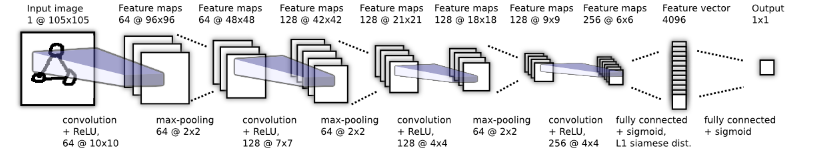

# One Shot Image Recognition

An implementation of the paper [Siamese Neural Networks for One-shot Image Recognition](https://www.cs.cmu.edu/~rsalakhu/papers/oneshot1.pdf).
The model architecture is as below (taken from the paper):

<p align="center">
  
</p>

With the only difference being same learning rate for all parameters, instead of layer wise learning rate as in the paper.
With this, achieves 93% accuracy with 30k pairs.

## Additional features:
* Training loss and validation accuracy are logged via TensorBoard.
* Best model as per validation accuracy saved at the end of training.

## Requirements (Python 3.6+):
* PyTorch
* Augmentor

## Usage:
* Download the Omniglot 'background' and 'evaluation' zip files from [here](https://github.com/brendenlake/omniglot).
* Run `data_prep.py` to split the dataset into train-val-test:
 ```
 python data_prep.py <DATA_DIR>
 ```
 where `DATA_DIR` is the directory containing both the zip files.
 * Run train.py to train the model:
```
python train.py <DATA_DIR>
```
* Hyperparameters such as learning rate, number of pairs fpr training, augmentation etc. can be changed in `train.py` .
